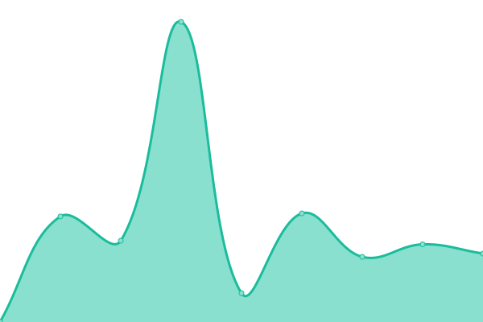
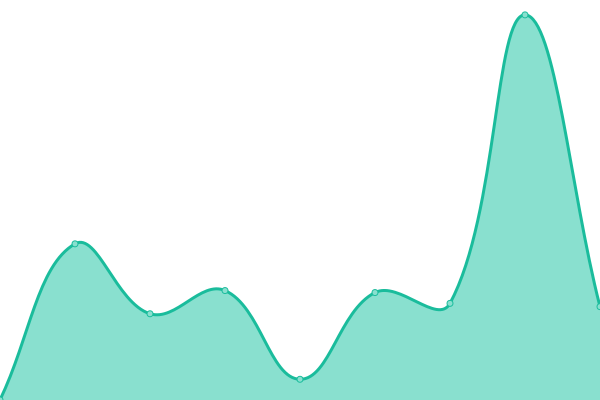
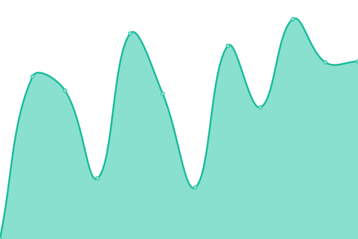
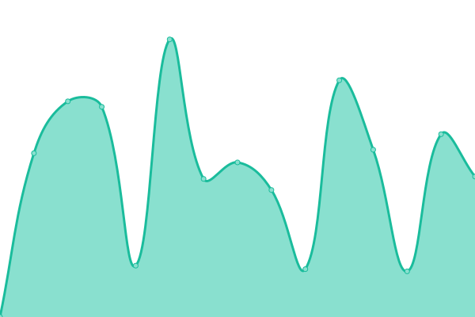

# [📈 Live Status](https://demo.upptime.js.org): <!--live status--> **🟩 All systems operational**

This repository contains the open-source uptime monitor and status page for [George Yiannoulopoulos](https://www.simplewebsolutions.gr), powered by [Upptime](https://github.com/upptime/upptime).

With [Upptime](https://upptime.js.org), you can get your own unlimited and free uptime monitor and status page, powered entirely by a GitHub repository. We use [Issues](https://github.com/simplegr/simple-uptime-status/issues) as incident reports, [Actions](https://github.com/simplegr/simple-uptime-status/actions) as uptime monitors, and [Pages](https://demo.upptime.js.org) for the status page.

<!--start: status pages-->
<!-- This summary is generated by Upptime (https://github.com/upptime/upptime) -->
<!-- Do not edit this manually, your changes will be overwritten -->
<!-- prettier-ignore -->
| URL | Status | History | Response Time | Uptime |
| --- | ------ | ------- | ------------- | ------ |
|  [Simple (GR)](https://www.simplewebsolutions.gr) | 🟩 Up | [simple-gr.yml](https://github.com/simplegr/simple-uptime-status/commits/HEAD/history/simple-gr.yml) | 

 1550ms
     
 | 

<a href="https://simplegr.github.io/simple-uptime-status/history/simple-gr">84.75%</a>
    

|  [Verum Coffee](https://www.verumcoffee.gr) | 🟩 Up | [verum-coffee.yml](https://github.com/simplegr/simple-uptime-status/commits/HEAD/history/verum-coffee.yml) | 

 1757ms
     
 | 

<a href="https://simplegr.github.io/simple-uptime-status/history/verum-coffee">84.79%</a>
    

|  [In Deep Analysis](https://indeepanalysis.gr) | 🟩 Up | [in-deep-analysis.yml](https://github.com/simplegr/simple-uptime-status/commits/HEAD/history/in-deep-analysis.yml) | 

 1108ms
     
 | 

<a href="https://simplegr.github.io/simple-uptime-status/history/in-deep-analysis">100.00%</a>
    

|  [MMC Group Holding Hellas](https://www.mmcgroupholding.com) | 🟩 Up | [mmc-group-holding-hellas.yml](https://github.com/simplegr/simple-uptime-status/commits/HEAD/history/mmc-group-holding-hellas.yml) | 

 1797ms
     
 | 

<a href="https://simplegr.github.io/simple-uptime-status/history/mmc-group-holding-hellas">84.84%</a>
    

|  [Mosfero](https://www.mosfero.com) | 🟩 Up | [mosfero.yml](https://github.com/simplegr/simple-uptime-status/commits/HEAD/history/mosfero.yml) | 

 1003ms
     
 | 

<a href="https://simplegr.github.io/simple-uptime-status/history/mosfero">100.00%</a>
    

|  [Regal Hotel](https://www.regalhotels.gr) | 🟩 Up | [regal-hotel.yml](https://github.com/simplegr/simple-uptime-status/commits/HEAD/history/regal-hotel.yml) | 

 1490ms
     
 | 

<a href="https://simplegr.github.io/simple-uptime-status/history/regal-hotel">84.89%</a>
    

|  [Santorini Best Tours (EN)](https://santorinibesttours.com) | 🟩 Up | [santorini-best-tours-en.yml](https://github.com/simplegr/simple-uptime-status/commits/HEAD/history/santorini-best-tours-en.yml) | 

 403ms
     
 | 

<a href="https://simplegr.github.io/simple-uptime-status/history/santorini-best-tours-en">100.00%</a>
    

|  [Santorini Best Tours (RU)](https://santorinibesttours.ru) | 🟩 Up | [santorini-best-tours-ru.yml](https://github.com/simplegr/simple-uptime-status/commits/HEAD/history/santorini-best-tours-ru.yml) | 

 1085ms
     
 | 

<a href="https://simplegr.github.io/simple-uptime-status/history/santorini-best-tours-ru">84.94%</a>
    

|  [Telmaco](https://www.telmaco.gr) | 🟩 Up | [telmaco.yml](https://github.com/simplegr/simple-uptime-status/commits/HEAD/history/telmaco.yml) | 

 1240ms
     
 | 

<a href="https://simplegr.github.io/simple-uptime-status/history/telmaco">84.99%</a>
    

|  [Δήμος Τρίπολης](https://www.tripolis.gr) | 🟩 Up | [dimos-tripolis.yml](https://github.com/simplegr/simple-uptime-status/commits/HEAD/history/dimos-tripolis.yml) | 

 1486ms
     
 | 

<a href="https://simplegr.github.io/simple-uptime-status/history/dimos-tripolis">68.71%</a>
    

|  [ΔΕΥΑΤ](https://deyatrip.gr) | 🟩 Up | [deyat.yml](https://github.com/simplegr/simple-uptime-status/commits/HEAD/history/deyat.yml) | 

 1196ms
     
 | 

<a href="https://simplegr.github.io/simple-uptime-status/history/deyat">85.04%</a>
    

|  [MSC ICSD Πανεπιστημίου Αιγαίου](https://msc.icsd.aegean.gr) | 🟩 Up | [msc-icsd-panepistimioy-aigaioy.yml](https://github.com/simplegr/simple-uptime-status/commits/HEAD/history/msc-icsd-panepistimioy-aigaioy.yml) | 

 1627ms
     
 | 

<a href="https://simplegr.github.io/simple-uptime-status/history/msc-icsd-panepistimioy-aigaioy">97.75%</a>
    

|  [E-LEARNING ΕΚΠΑ](https://elearningekpa.gr) | 🟩 Up | [e-learning-ekpa.yml](https://github.com/simplegr/simple-uptime-status/commits/HEAD/history/e-learning-ekpa.yml) | 

 1650ms
     
 | 

<a href="https://simplegr.github.io/simple-uptime-status/history/e-learning-ekpa">100.00%</a>
    

|  [Emtech Space](https://emtech.space) | 🟩 Up | [emtech-space.yml](https://github.com/simplegr/simple-uptime-status/commits/HEAD/history/emtech-space.yml) | 

 2465ms
     
 | 

<a href="https://simplegr.github.io/simple-uptime-status/history/emtech-space">68.73%</a>
    

|  [VECHRO](https://www.vechro.gr) | 🟩 Up | [vechro.yml](https://github.com/simplegr/simple-uptime-status/commits/HEAD/history/vechro.yml) | 

 904ms
     
 | 

<a href="https://simplegr.github.io/simple-uptime-status/history/vechro">100.00%</a>
    

|  [EXECUTIVE MBA ΕΚΠΑ](https://emba.ba.uoa.gr) | 🟩 Up | [executive-mba-ekpa.yml](https://github.com/simplegr/simple-uptime-status/commits/HEAD/history/executive-mba-ekpa.yml) | 

 1488ms
     
 | 

<a href="https://simplegr.github.io/simple-uptime-status/history/executive-mba-ekpa">85.09%</a>
    

|  [YOGAUNION BALI](https://yogaunionbali.com) | 🟩 Up | [yogaunion-bali.yml](https://github.com/simplegr/simple-uptime-status/commits/HEAD/history/yogaunion-bali.yml) | 

 1117ms
     
 | 

<a href="https://simplegr.github.io/simple-uptime-status/history/yogaunion-bali">85.14%</a>
    

|  [ESOS](https://www.esos.gr) | 🟩 Up | [esos.yml](https://github.com/simplegr/simple-uptime-status/commits/HEAD/history/esos.yml) | 

 1191ms
     
 | 

<a href="https://simplegr.github.io/simple-uptime-status/history/esos">68.86%</a>
    

|  [HYPERELEON](https://www.hypereleon.com) | 🟩 Up | [hypereleon.yml](https://github.com/simplegr/simple-uptime-status/commits/HEAD/history/hypereleon.yml) | 

 364ms
     
 | 

<a href="https://simplegr.github.io/simple-uptime-status/history/hypereleon">100.00%</a>
    

|  [SYNENERGY ADVISORS](https://www.synenergy-advisors.com) | 🟩 Up | [synenergy-advisors.yml](https://github.com/simplegr/simple-uptime-status/commits/HEAD/history/synenergy-advisors.yml) | 

 1782ms
     
 | 

<a href="https://simplegr.github.io/simple-uptime-status/history/synenergy-advisors">85.19%</a>
    

|  [THERMOFOIL](https://www.thermofoil.gr) | 🟩 Up | [thermofoil.yml](https://github.com/simplegr/simple-uptime-status/commits/HEAD/history/thermofoil.yml) | 

 1853ms
     
 | 

<a href="https://simplegr.github.io/simple-uptime-status/history/thermofoil">85.24%</a>
    

|  [LINGO POWERS](https://www.lingopowers.gr) | 🟩 Up | [lingo-powers.yml](https://github.com/simplegr/simple-uptime-status/commits/HEAD/history/lingo-powers.yml) | 

 1029ms
     
 | 

<a href="https://simplegr.github.io/simple-uptime-status/history/lingo-powers">68.98%</a>
    

|  [DOMO ENERGY](https://domo-energy.gr) | 🟩 Up | [domo-energy.yml](https://github.com/simplegr/simple-uptime-status/commits/HEAD/history/domo-energy.yml) | 

 1410ms
     
 | 

<a href="https://simplegr.github.io/simple-uptime-status/history/domo-energy">85.29%</a>
    

|  [KADRO](https://kadro.gr) | 🟩 Up | [kadro.yml](https://github.com/simplegr/simple-uptime-status/commits/HEAD/history/kadro.yml) | 

 1239ms
     
 | 

<a href="https://simplegr.github.io/simple-uptime-status/history/kadro">85.34%</a>
    

|  [PRIMROSE APARTMENTS](https://www.primrose.gr) | 🟩 Up | [primrose-apartments.yml](https://github.com/simplegr/simple-uptime-status/commits/HEAD/history/primrose-apartments.yml) | 

 1000ms
     
 | 

<a href="https://simplegr.github.io/simple-uptime-status/history/primrose-apartments">69.10%</a>
    

|  [I-EKEP](https://i-ekep.gr) | 🟩 Up | [i-ekep.yml](https://github.com/simplegr/simple-uptime-status/commits/HEAD/history/i-ekep.yml) | 

 1576ms
     
 | 

<a href="https://simplegr.github.io/simple-uptime-status/history/i-ekep">85.39%</a>
    

|  [TELIS FASHION](https://www.telisfashion.gr) | 🟩 Up | [telis-fashion.yml](https://github.com/simplegr/simple-uptime-status/commits/HEAD/history/telis-fashion.yml) | 

 893ms
     
 | 

<a href="https://simplegr.github.io/simple-uptime-status/history/telis-fashion">100.00%</a>
    

|  [UNIQUE AND FOREVER](https://www.uniqueandforever.com) | 🟩 Up | [unique-and-forever.yml](https://github.com/simplegr/simple-uptime-status/commits/HEAD/history/unique-and-forever.yml) | 

 752ms
     
 | 

<a href="https://simplegr.github.io/simple-uptime-status/history/unique-and-forever">100.00%</a>
    

|  [GLOW CLEANING](https://www.glowcleaning.gr) | 🟩 Up | [glow-cleaning.yml](https://github.com/simplegr/simple-uptime-status/commits/HEAD/history/glow-cleaning.yml) | 

 1368ms
     
 | 

<a href="https://simplegr.github.io/simple-uptime-status/history/glow-cleaning">85.43%</a>
    

|  [ERGOMARE](https://www.ergomare.gr) | 🟩 Up | [ergomare.yml](https://github.com/simplegr/simple-uptime-status/commits/HEAD/history/ergomare.yml) | 

 1566ms
     
 | 

<a href="https://simplegr.github.io/simple-uptime-status/history/ergomare">85.48%</a>
    

|  [DECO CONSTRUCTION](https://www.decoconstruction.gr) | 🟩 Up | [deco-construction.yml](https://github.com/simplegr/simple-uptime-status/commits/HEAD/history/deco-construction.yml) | 

 1280ms
     
 | 

<a href="https://simplegr.github.io/simple-uptime-status/history/deco-construction">69.27%</a>
    

|  [ΚΛΕΙΔΟΓΝΩΣΙΑ](https://www.kleidognosia.gr) | 🟩 Up | [kleidognosia.yml](https://github.com/simplegr/simple-uptime-status/commits/HEAD/history/kleidognosia.yml) | 

 863ms
     
 | 

<a href="https://simplegr.github.io/simple-uptime-status/history/kleidognosia">69.30%</a>
    

|  [Σαχπένογλου](https://www.saxpenoglou.gr) | 🟩 Up | [saxpenogloy.yml](https://github.com/simplegr/simple-uptime-status/commits/HEAD/history/saxpenogloy.yml) | 

 1249ms
     
 | 

<a href="https://simplegr.github.io/simple-uptime-status/history/saxpenogloy">69.33%</a>
    

|  [Novogas](https://www.novogas.gr) | 🟩 Up | [novogas.yml](https://github.com/simplegr/simple-uptime-status/commits/HEAD/history/novogas.yml) | 

 1699ms
     
 | 

<a href="https://simplegr.github.io/simple-uptime-status/history/novogas">100.00%</a>
    

|  [iShine](https://www.ishine.gr) | 🟩 Up | [i-shine.yml](https://github.com/simplegr/simple-uptime-status/commits/HEAD/history/i-shine.yml) | 

 1426ms
     
 | 

<a href="https://simplegr.github.io/simple-uptime-status/history/i-shine">85.54%</a>
    

|  [Μπουρντένης](https://www.mpourntenis.gr) | 🟩 Up | [mpoyrntenis.yml](https://github.com/simplegr/simple-uptime-status/commits/HEAD/history/mpoyrntenis.yml) | 

 1413ms
     
 | 

<a href="https://simplegr.github.io/simple-uptime-status/history/mpoyrntenis">85.59%</a>
    

|  [Εκδόσεις Μ.Γκιούρδας](https://www.mgiurdas.gr) | 🟩 Up | [ekdoseis-m-gkioyrdas.yml](https://github.com/simplegr/simple-uptime-status/commits/HEAD/history/ekdoseis-m-gkioyrdas.yml) | 

 1490ms
     
 | 

<a href="https://simplegr.github.io/simple-uptime-status/history/ekdoseis-m-gkioyrdas">85.64%</a>
    

|  [Hillside Press](https://www.elthillside.com) | 🟩 Up | [hillside-press.yml](https://github.com/simplegr/simple-uptime-status/commits/HEAD/history/hillside-press.yml) | 

 1182ms
     
 | 

<a href="https://simplegr.github.io/simple-uptime-status/history/hillside-press">85.68%</a>
    

|  [Αδέσποτα Δήμου Τρίπολης](https://www.animalscityoftripolis.gr) | 🟩 Up | [adespota-dimoy-tripolis.yml](https://github.com/simplegr/simple-uptime-status/commits/HEAD/history/adespota-dimoy-tripolis.yml) | 

 914ms
     
 | 

<a href="https://simplegr.github.io/simple-uptime-status/history/adespota-dimoy-tripolis">69.55%</a>
    

|  [Oinocosmetics](https://www.oinocosmetics.gr) | 🟩 Up | [oinocosmetics.yml](https://github.com/simplegr/simple-uptime-status/commits/HEAD/history/oinocosmetics.yml) | 

 1631ms
     
 | 

<a href="https://simplegr.github.io/simple-uptime-status/history/oinocosmetics">85.73%</a>
    

|  [Δημητρακόπουλος](https://www.dimitrakopoulos-welding.com) | 🟩 Up | [dimitrakopoylos.yml](https://github.com/simplegr/simple-uptime-status/commits/HEAD/history/dimitrakopoylos.yml) | 

 1495ms
     
 | 

<a href="https://simplegr.github.io/simple-uptime-status/history/dimitrakopoylos">85.78%</a>
    

|  [Thelo Anakainisi](http://theloanakainisi.gr) | 🟩 Up | [thelo-anakainisi.yml](https://github.com/simplegr/simple-uptime-status/commits/HEAD/history/thelo-anakainisi.yml) | 

 1949ms
     
 | 

<a href="https://simplegr.github.io/simple-uptime-status/history/thelo-anakainisi">85.83%</a>
    

<!--end: status pages-->

[**Visit our status website →**](https://demo.upptime.js.org)

## 📄 License

- Powered by: [Upptime](https://github.com/upptime/upptime)
- Code: [MIT](./LICENSE) © [Anand Chowdhary](https://anandchowdhary.com), supported by [Pabio](https://pabio.com)
- Data in the `./history` directory: [Open Database License](https://opendatacommons.org/licenses/odbl/1-0/)
